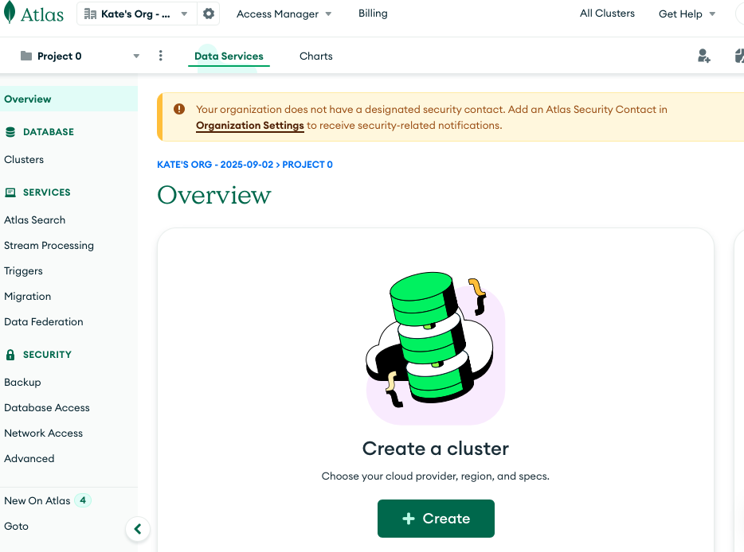
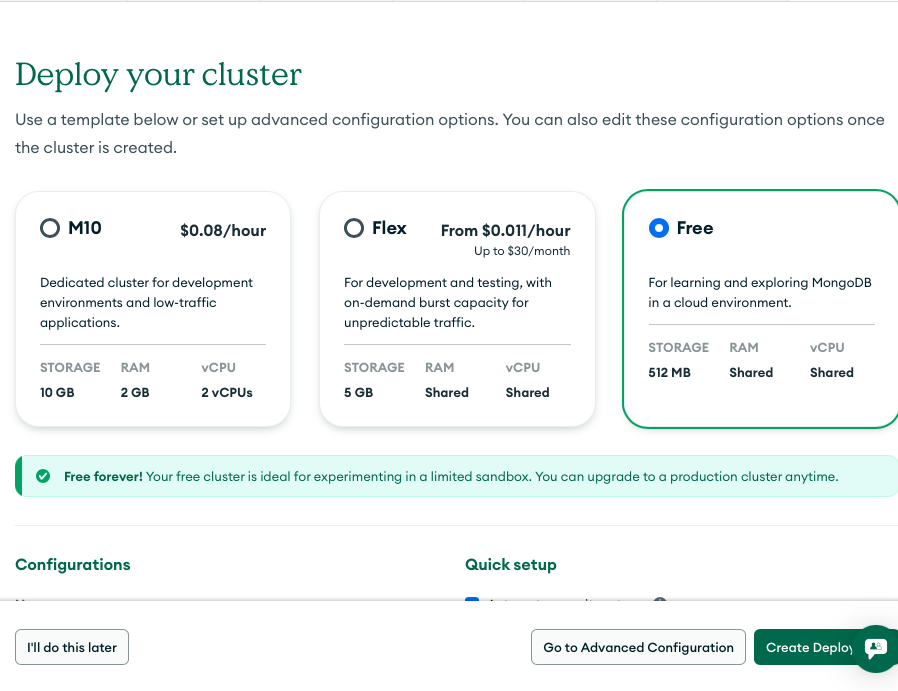
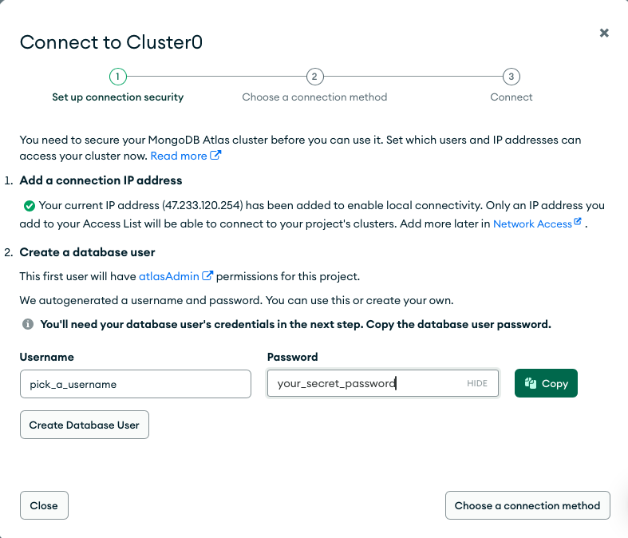
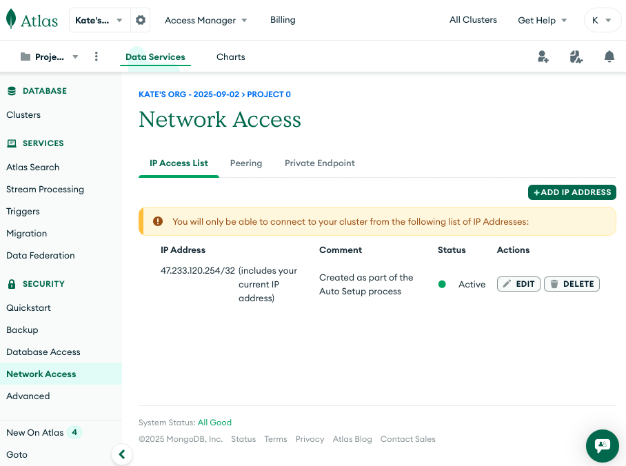
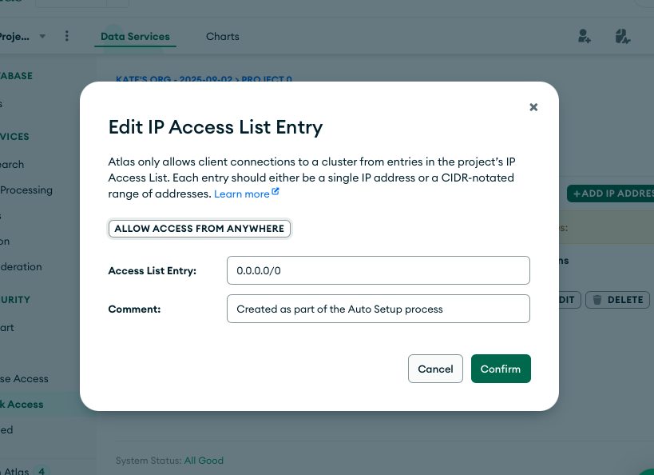
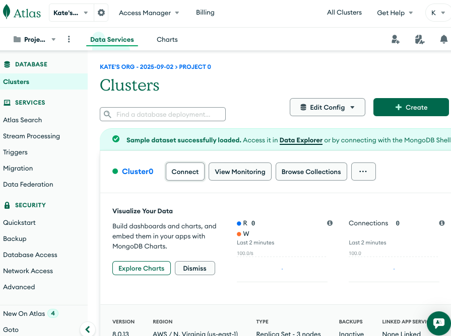
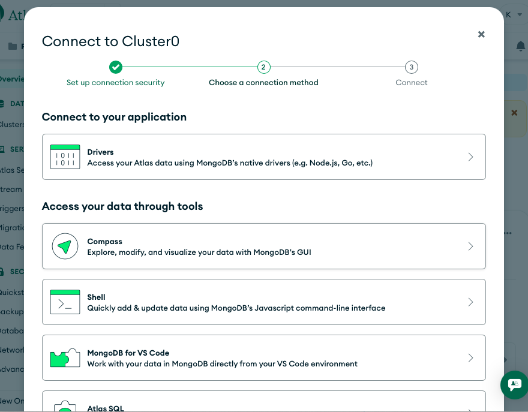
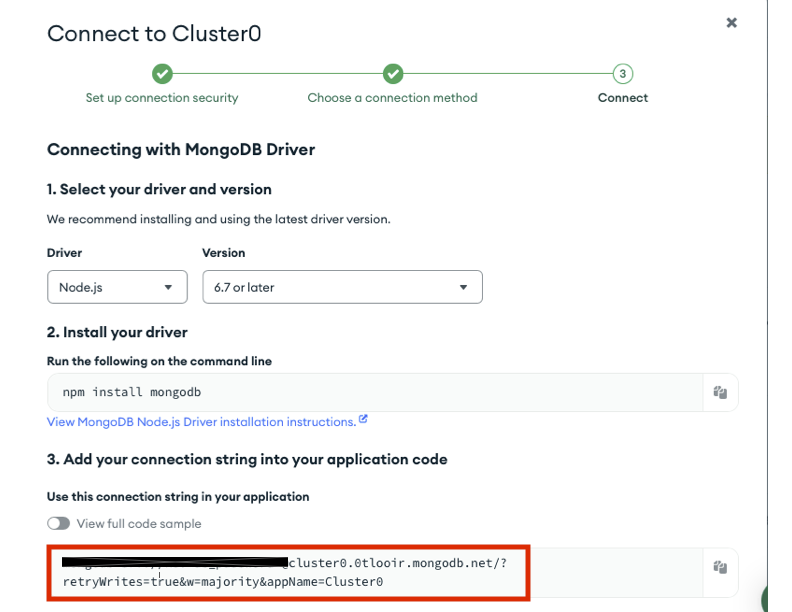

# Application for shelter volunteers to manage their volunteer time

This application is a work in progress. It uses Flask server with a React JS client.

## Project Overview

Homeless shelters rely on volunteers' help. When inclement weather strikes, homeless shelters get filled with people that need a place to stay, and volunteers' help becomes even more important. There are many people willing to volunteer, but knowing which shelter lacks help is a challenge. The purpose of this application is to simplify the process of scheduling work shifts for volunteers, and to give homeless shelters visibility into their upcoming staffing. The application allows volunteers to select shelters and times when they want to work, see which shelters (and which times) urgently need help, and cancel/reschedule their shifts.

## Getting Started

Follow the steps below to create a local development environment. These instructions were verified on clean installs of macOS Sonoma 14.6 and Windows 11.

### Prerequisites
- Git
- Python 3.8 or later with pip
- Node.js 18 or later with npm
- A MongoDB Atlas account (or other MongoDB connection string)
- (Optional) Docker Desktop 4.27+ for the Docker workflow shown below

### 1. Clone the repository
```bash
git clone https://github.com/oss-slu/shelter_volunteers.git
cd shelter_volunteers
```

### 2. Install dependencies
#### Server (Flask)
```bash
cd server
python -m venv venv
# macOS / Linux
source venv/bin/activate
# Windows PowerShell
.\venv\Scripts\activate
pip install --upgrade pip
pip install -r requirements.txt
```

#### Client (React)
```bash
cd ../client_app
npm install
cd ..
```

### 3. Configure environment variables
Create `server/.env.pre-production` and add the following values (remove the angle brackets):
```
MONGODB_HOST=<Atlas connection string without credentials>
MONGODB_USERNAME=<MongoDB username>
MONGODB_PASSWORD=<MongoDB password>
GOOGLE_CLIENT_ID=<Copy the value of REACT_APP_GOOGLE_CLIENT_ID from client_app/src/config.js>
JWT_SECRET=<Any long random string>
```
Keep this file local—do not commit it to the repository.

### 4. Configure MongoDB access (first-time setup)
If you do not already have a MongoDB Atlas cluster, follow the walkthrough below (with screenshots) to provision one and capture the connection string referenced above. Once the cluster is ready, return to the remaining steps.

#### Configure a database connection through MongoDB Atlas
Sign in to MongoDB Atlas. You can sign up for a free account or use Google Login. Follow the prompts to create an account and sign in.

Once you are signed in, click on **Create New Cluster**.



Select the free tier and click on **Create Deployment**.



On the Connection Security screen, pick a username and password you will use to connect to the database. You can change these later if needed. Click **Close**.



From the left navigation menu select **Network Access**.



Allow connections from either your current IP address or from anywhere (for quick local development). Click **Confirm** to save your changes.



Next, capture the connection string. From the **Clusters** page click **Connect** next to your cluster name.



Choose the **Drivers** option and copy the connection string that is displayed. Remove the placeholder username and password from the copied string.





Save this string—you will paste it into the `MONGODB_HOST` value in your `.env.pre-production` file.

### 5. Run the development servers
Use two terminal windows or tabs:

**Terminal A – Flask API**
```bash
cd server
source venv/bin/activate        # macOS / Linux
# Windows PowerShell
.\venv\Scripts\Activate.ps1
bash run_dev_server.sh
```
The API is available at `http://localhost:5001`.

**Terminal B – React client**
```bash
cd client_app
npm start
```
The client is available at `http://localhost:3000`.

### 6. Run automated tests
```bash
# Server tests
cd server
source venv/bin/activate        # or .\venv\Scripts\activate on Windows
pytest

# Client tests
cd ../client_app
npm test
```
The React test runner watches files for changes. Press `q` to exit the watch mode when you are done.

### 7. (Optional) Give yourself system admin access
By default a new account only has volunteer permissions. To test the admin features, promote your account via the CLI.

```bash
cd server
source venv/bin/activate                        # or .\venv\Scripts\activate
export PYTHONPATH=$(pwd)                        # Windows PowerShell: $Env:PYTHONPATH = (Get-Location)
export FLASK_ENV="pre-production"              # Windows PowerShell: $Env:FLASK_ENV = "pre-production"
python cli/admin_cli.py system <YOUR_GOOGLE_EMAIL_ADDRESS>
```
Sign out and sign back in. You may need to clear your browser cache before the new access level appears.

### OS-specific notes
- If your system defaults to Python 2, replace `python` with `python3` and `pip` with `pip3`.
- Windows command prompt users can activate the virtual environment with `venv\Scripts\activate.bat`.
- To create `.env.pre-production` on Windows, use `New-Item -Path server/.env.pre-production -ItemType File`.

### Verification
The steps above were executed in clean macOS Sonoma 14.6 and Windows 11 environments. If any command fails on your platform, please open an issue so we can update the documentation.

### Optional: Docker workflow
If you prefer to run the full stack with Docker Compose:

1. Install Docker Desktop (https://www.docker.com/get-started/).
2. Start the Docker engine. On Windows ensure the **Docker Desktop Service** is running.
3. From the repository root run one of the following commands:
   - Demo mode (no live reload): `docker-compose up`
   - Development mode (auto reload): `docker compose up --watch`
4. For development, log in with `developer@slu.edu` and any password. This bypass only works when the server runs in DEBUG mode with the developer configuration enabled.

## Contributing

We welcome contributions of all sizes. Before opening a pull request:

1. Read the [contributing guide](CONTRIBUTING.md) for coding standards, commit conventions, and review expectations.
2. Pick an existing issue or create a new one describing the change you plan to make.
3. Develop your work on a feature branch, add or update tests as needed, and open a pull request when ready.

The contributing guide also covers how to report bugs and propose new features.
