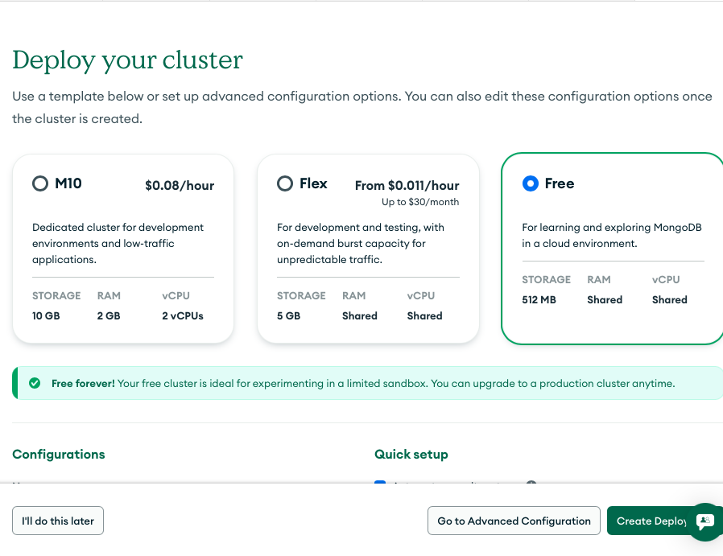
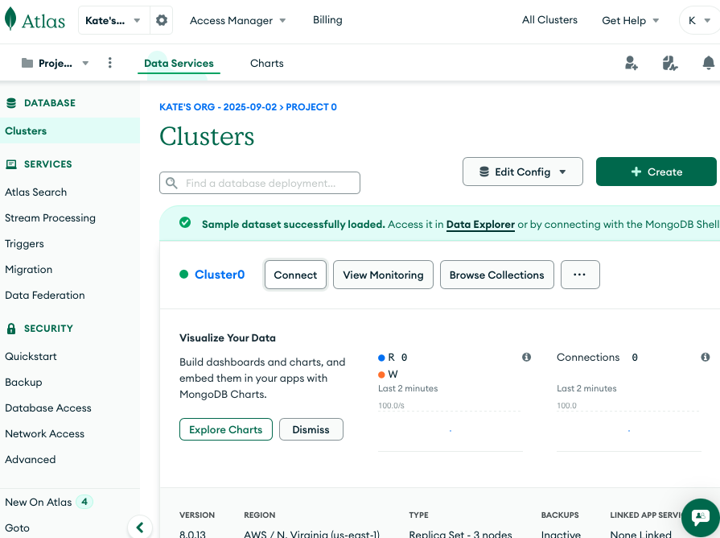
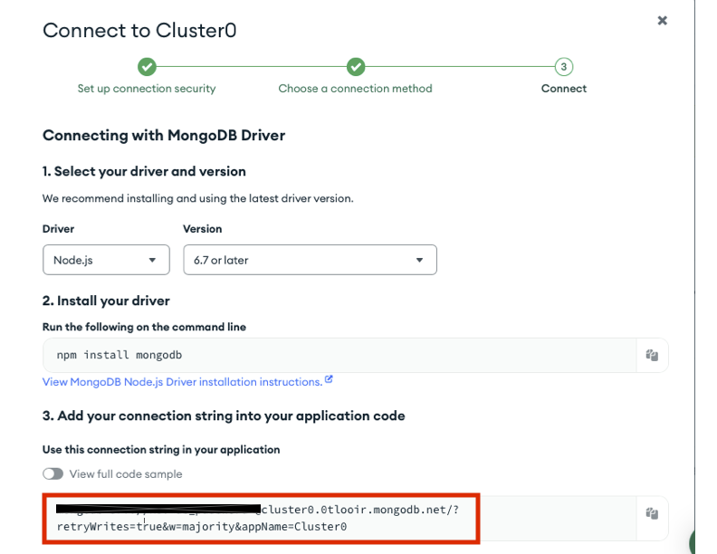

# How to Create a MongoDB Atlas Connection

This guide walks you through creating a MongoDB Atlas cluster and capturing the connection string needed for local development.

## Prerequisites
- A MongoDB Atlas account (you can sign up for a free account or use Google Login)

## Step-by-Step Setup

### 1. Sign in to MongoDB Atlas
Sign in to MongoDB Atlas. You can sign up for a free account or use Google Login. Follow the prompts to create an account and sign in.

### 2. Create a New Cluster
Once you are signed in, click on **Create New Cluster**.

### 3. Select Free Tier
Select the free tier and click on **Create Deployment**.

### 4. Set Up Connection Security
On the Connection Security screen, pick a username and password you will use to connect to the database. You can change these later if needed. Click **Close**.

### 5. Configure Network Access
From the left navigation menu select **Network Access**.

Allow connections from either your current IP address or from anywhere (for quick local development). Click **Confirm** to save your changes.

### 6. Capture the Connection String
Next, capture the connection string. From the **Clusters** page click **Connect** next to your cluster name.

Choose the **Drivers** option and copy the connection string that is displayed. Remove the placeholder username and password from the copied string.

### 7. Use the Connection String
Save this string—you will paste it into the `MONGODB_HOST` value in your `server/.env.pre-production` file. The username and password you created in step 4 should be used for the `MONGODB_USERNAME` and `MONGODB_PASSWORD` values in the same file.

