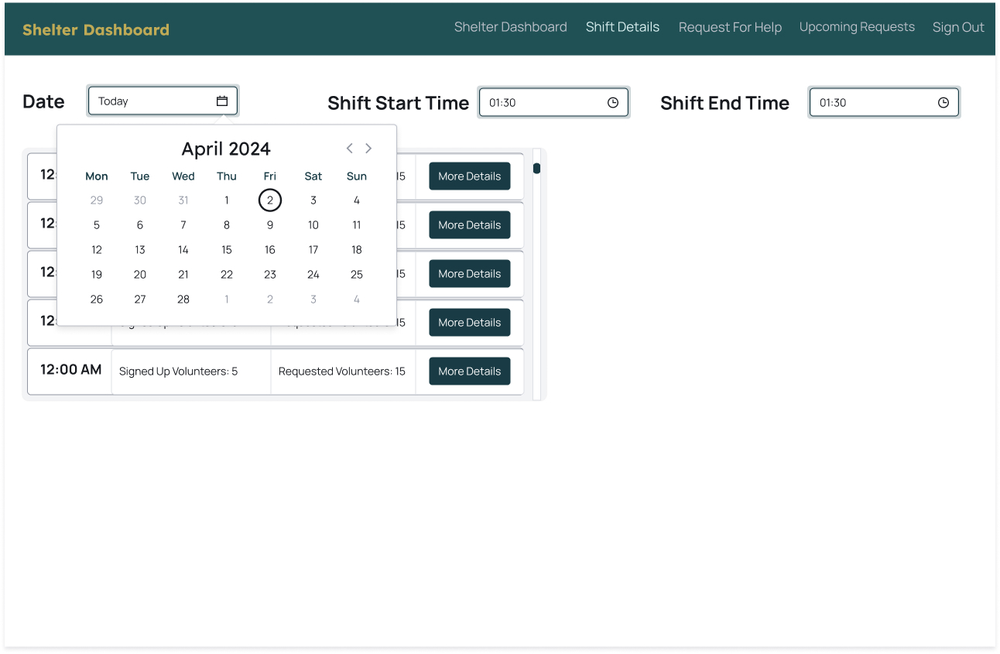
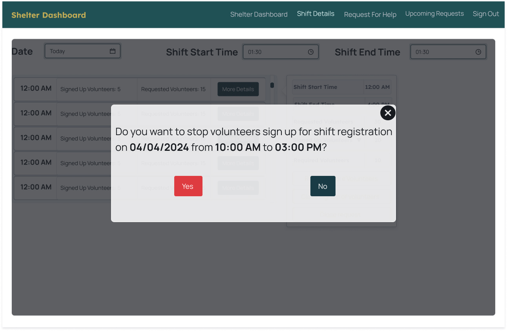
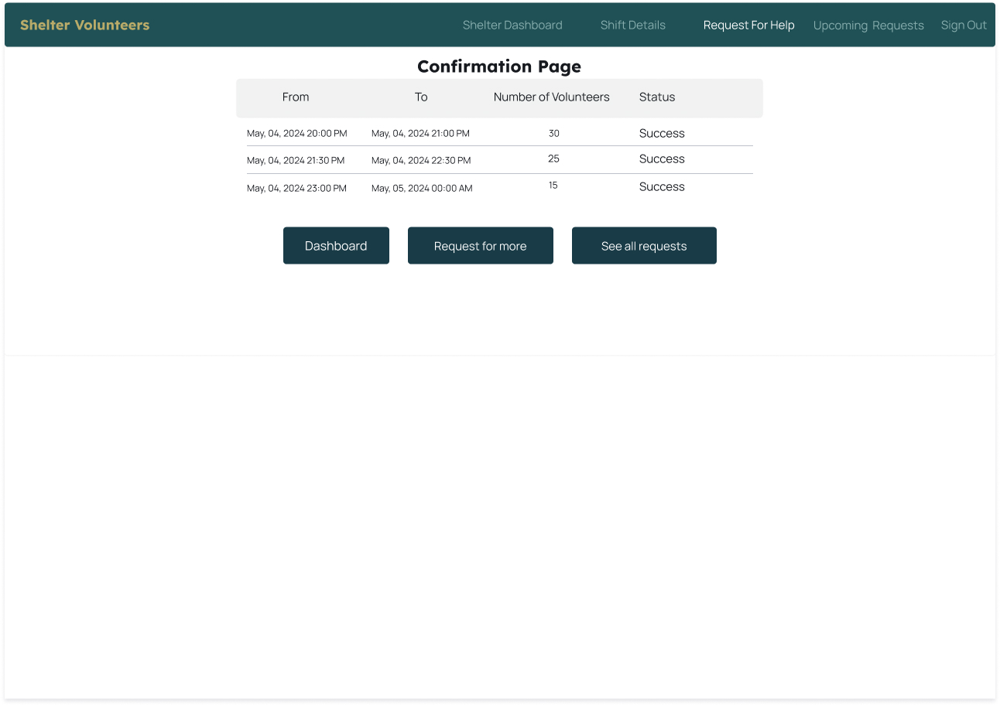
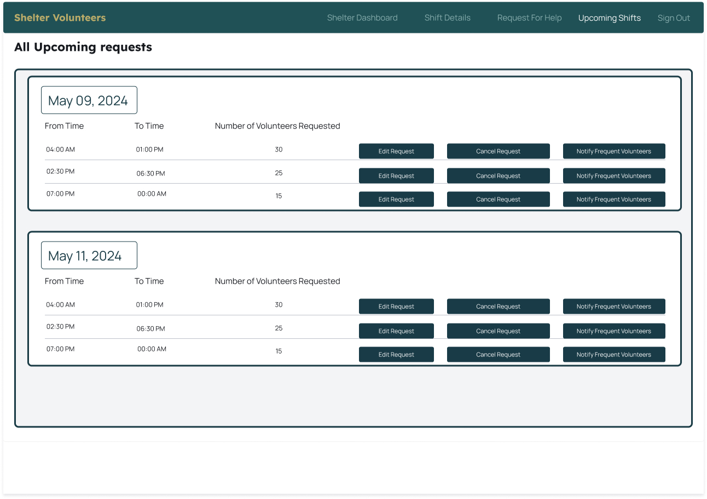

# Shelter dashboard flow.

Shelter dashboard has a navigation bar with Shelter dashboard, Shift details, Request for help, Upcoming requests and Sign out options.
The dashboard shares an brief overview of different shifts scheduled for the day, upcoming requests for help and past volunteers who volunteered at this particular shelter.

Shift details Page/ Screen 1
Displays all the roster for the selected day from the calendar and time option with all different shifts for the day as per filtered date and time criteria. 

Date and Time can be used to filter the day and time.

For each shift requested all the details including shift start time, shift end time, number of volunteers requested, number of volunteers signed up and how many more volunteers are required for the particular shift are displayed along with buttons for requesting more volunteers, closing the sign up for volunteers for the selected shift and closing(delete) the request itself. All these are displayed on clicking the more details button.

On clicking the button beside signed up volunteers, a modal window with the list of volunteers with details as volunteer name, date, shift start time, shift end time, and a button to send them a notification (email) is displayed.

On clicking the close request button a modal window with confirmation message detailing the particulars of the shift like date, shift start time, shift end time is displayed.

The Request for help in the navigation bar will redirect to this page, it is a provision to request help for a particular day and time along with number of volunteers required.
On adding all the different requests, they can be submitted. 

On submission in the Request_for_help page it'll redirect to the confirmation page.

The All upcoming requests page in the navigation bar will redirect to this page, it displays all the upcoming requests made by the shelter.